## Step 1: Enable Code Quality

Parents have been calling the front office at Mergington High. A student signed up for Chess Club and never appeared on the roster, another got into Drama even though the activity was already full, and a third says the same email is registered twice for the same club.

The issue tracker has several reports pointing at the same signup flow, but it does not say where the bugs live or why. Before you start writing fixes, you decide it is time to enable Code Quality to get a systematic view of what is actually in the codebase.

### 📖 Theory: Finding Quality Issues

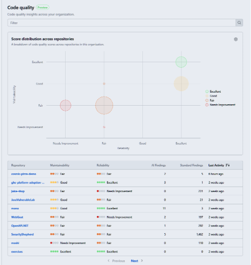

Code Quality gives you maintainability and reliability findings directly in your repository.

- **Standard findings** — static analysis results (e.g., CodeQL) covering the whole codebase.
- **AI findings** — context-aware feedback that appears as you work, including on pull requests.
- **Code coverage** — shows how much of your code is exercised by tests.
- **Rulesets** — turn findings and coverage into enforceable merge requirements.
- **Organization rollup** — lets admins view findings across every repository in an organization from one place. This is not covered in this exercise, but the image on the right shows an example.

> [!NOTE]
> Enabling Code Quality starts an analysis workflow on the default branch and consumes GitHub Actions minutes. Review [Code Quality billing details](https://docs.github.com/en/billing/concepts/product-billing/github-code-quality) for more information.

### 📖 Theory: Standard Findings

- **Standard findings** are produced by static analysis rules (e.g., CodeQL) and surface common reliability and maintainability issues across the codebase.
- Findings are displayed in the **Security and quality** tab under **Code quality** > **Standard findings**, and can be filtered by severity or category.
- Reviewing findings first helps your team focus on the highest-risk problems before making changes.

Read more:

- [Enable Code Quality](https://docs.github.com/en/code-security/how-tos/maintain-quality-code/enable-code-quality)
- [Maintain Quality Code](https://docs.github.com/en/code-security/how-tos/maintain-quality-code)
- [Interpret Results](https://docs.github.com/en/code-security/how-tos/maintain-quality-code/interpret-results)
- [Organization Code Quality Results](https://docs.github.com/en/code-security/how-tos/view-and-interpret-data/analyze-organization-data/explore-code-quality)

### ⌨️ Activity: Enable Code Quality

1. Open another browser tab and navigate to this exercise repository.

1. In the top navigation, select the **Settings** tab.

   

1. In the left sidebar, find and select **Code quality**.

   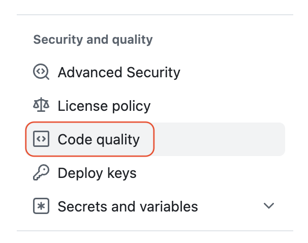

1. At the top of the page, select the **Enable code quality** button.

   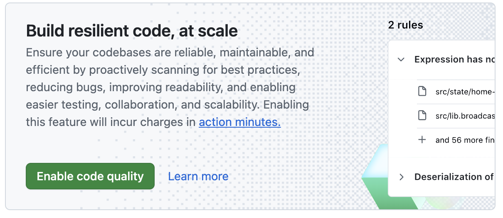

1. Take a moment to review the **Code Quality** page, and notice the various configuration options.
   - The toggle shows **Code Quality** is indeed enabled.
   - The detected languages are **JavaScript** and **Python**, aligning with our sample project.
   - Scans will run using standard GitHub runners.
   - The target is our default branch (`main`).
   - Scan events are `push`, `pull request` and weekly.

1. If needed, wait for a bit longer for the initial Code Quality scans to finish.

   > 💡 **Tip:** You can monitor progress by selecting the **Actions** tab in the top navigation.

   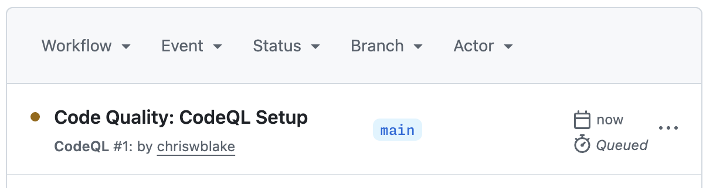

<!-- 1. When the **Code Quality** analysis finishes, Mona will detect it and share the next steps. Continue to the next activity while the scan completes. -->

Having trouble? 🤷
 

- If you do not see the **Code quality** option, your account may not have access to the feature. Please [check your availability](https://docs.github.com/en/code-security/concepts/about-code-quality#availability-and-usage-costs).
- If the scan does not start, refresh the settings page and confirm the **Enable** button was selected.

### ⌨️ Activity: Fix a Standard Finding

1. In the top navigation, select the **Security and quality** tab.

   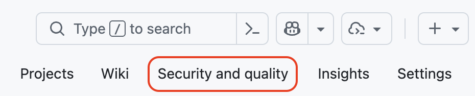

1. In the left navigation, find the **Code quality** section and select **Standard findings**. Take a moment to review the results of this initial setup.

   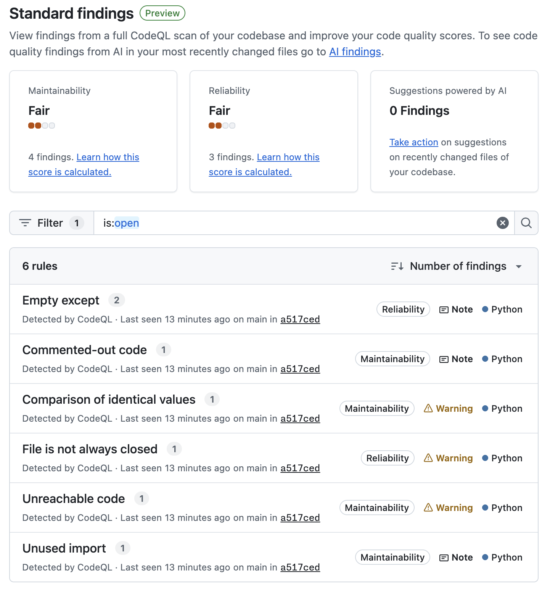

1. Try using the **Filter** bar to search the list of findings, for example by **Severity** or **Category**.

   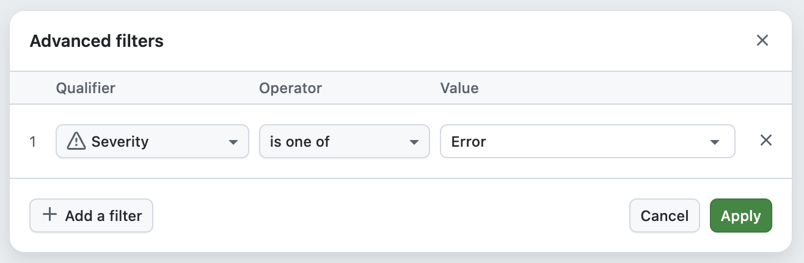

1. Find and click on the item titled `Commented-out code` to show a details page.

   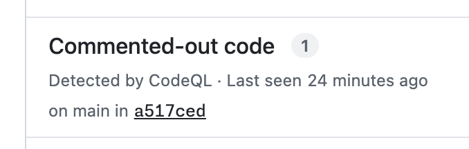

1. Click the **Show More** button to display additional details like an example problem and a recommended solution.

   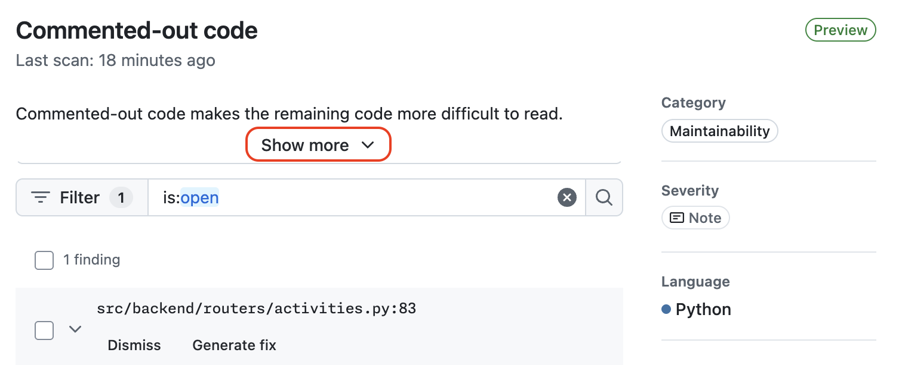

1. Click the **Generate Fix** button, wait a moment, and review the suggestion.

   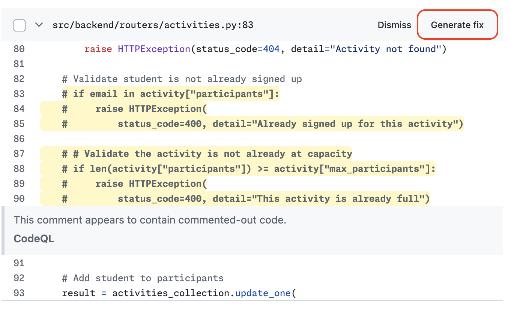

1. Click the **Open pull request** button. Use the default recommendations and press the **Commit change** button to start the draft pull request.

   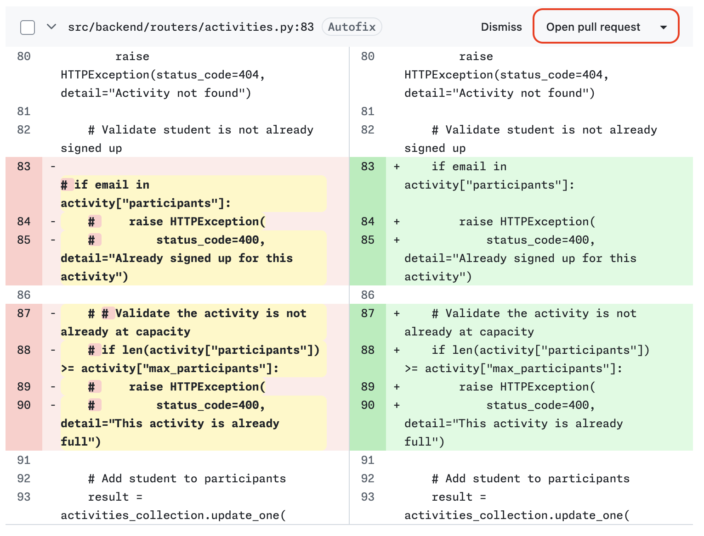

   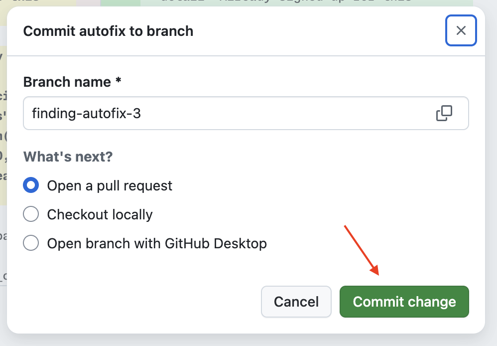

1. On the newly created pull request, click the **Ready for review** button to make it active.

1. Wait a moment for the Code Quality scans (CodeQL) to finish, then click the **Merge pull request button**. After merging, you can delete this temporary branch.

1. With the quality issue fixed, by merging the pull request, Mona will share the next steps.

1. (optional) While you wait for the next steps, consider returning to the **Code Quality** page and inspecting the **Standard Findings** list again. Notice that the `Commented-out code` entry has been removed.

   
Having trouble? 🤷
 

- If findings are still loading, wait for the scans to complete, then refresh the page.
- If the expected quality issue is not in the list, you can select another. Any of them will pass this step.

