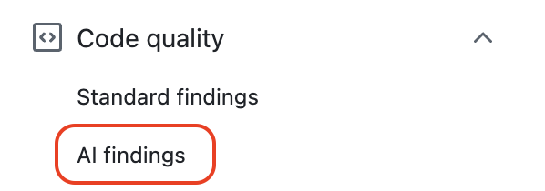
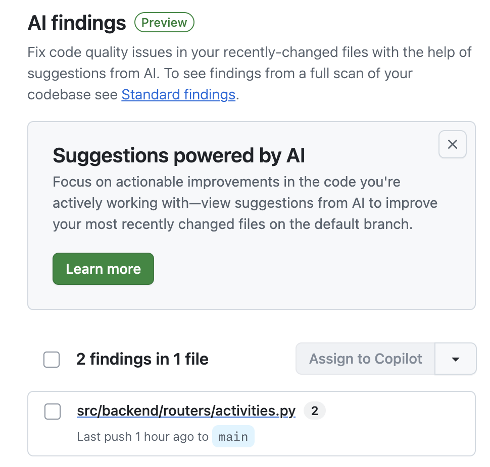
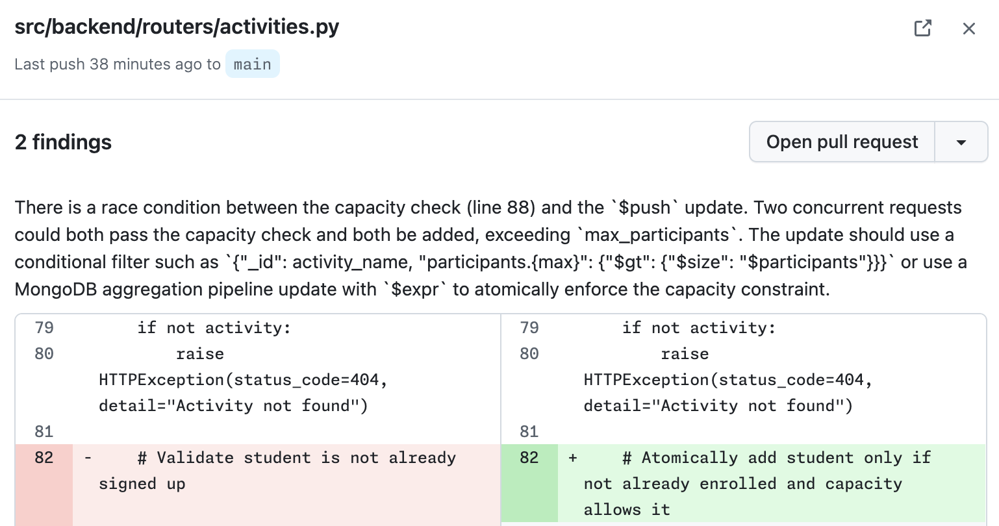
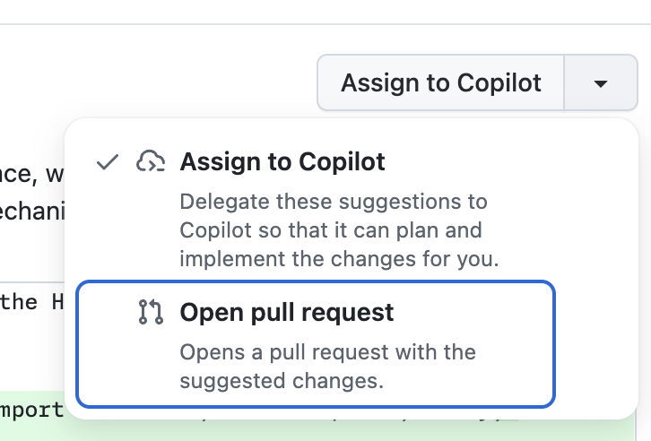
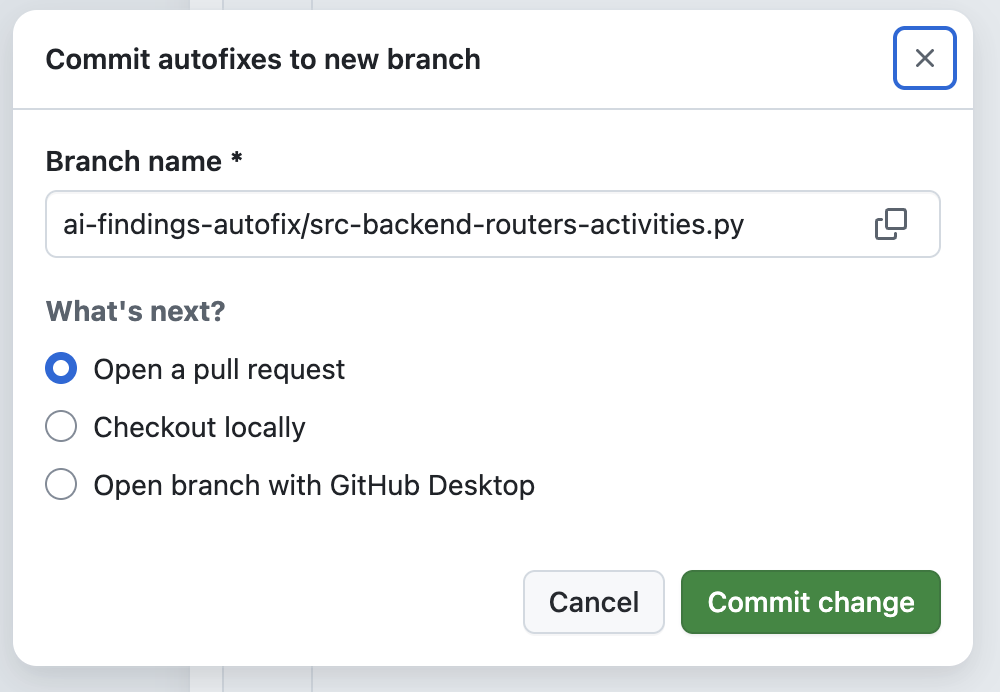

## Step 2: AI Findings

Standard findings pointed to structural issues right where the signup complaints were coming from. Before you start rewriting things yourself, you want a second opinion, one that can catch problems standard rules alone might miss. Now it is time to learn about AI findings and start fixing one of the problems it can uncover.

### 📖 Theory: AI Feedback As You Work


Code Quality uses two complementary scans to catch issues: standard findings use CodeQL rules on pull requests, while **AI findings** use a Copilot to analyze code shortly as your work.

- As you work, Code Quality runs an AI scan of the most recently changed files.
- Unlike CodeQL rules, the AI scan works across all languages and can surface issues that don't match a predefined rule, such as logic errors or code that is technically valid but likely unintentional.
- Findings appear in the **Security and quality** tab under **Code quality** > **AI findings**, listing each file along with its number of detected issues.
- This view is empty if the repository is inactive, or if the AI scan doesn't find any opportunities for improvement in the most recent merges.

Read more:

- [Improve Recently Merged Code With AI](https://docs.github.com/en/code-security/code-quality/tutorials/improve-recent-merges)
- [Interpret Results](https://docs.github.com/en/code-security/how-tos/maintain-quality-code/interpret-results)

### ⌨️ Activity: Fix an AI Finding

> [!Important]
> Sometimes no AI findings are shown. In this case, you may skip this step by adding an issue comment asking Mona to go to the next step.

```txt
Mona, there were no AI findings. Please go to step 3.
```

1. In the top navigation, select the **Security and quality** tab.

   

1. In the left navigation, find the **Code quality** section and select **AI findings**.

   

1. In the list of AI findings, click on the item about the `activities.py` file. This will show more details, including recommended changes from Copilot.

   

   

1. In the top right, expand the button and select the **Open pull request** option. In the form, accept the defaults and select **Commit change**.

   

   

1. On the newly created pull request, click the **Ready for review** button to make it active.

1. Wait a moment for the Code Quality scans (CodeQL) to finish, then click the **Merge pull request button**. After merging, you can delete this temporary branch.

1. With the quality issue fixed, by merging the pull request, Mona will share the next steps.

<details>
<summary>Having trouble? 🤷</summary><br/>

- If the expected quality issue is not in the list, you can select another. Any of them will pass this step.

</details>
