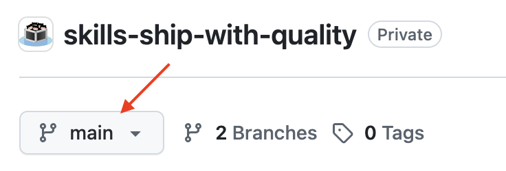
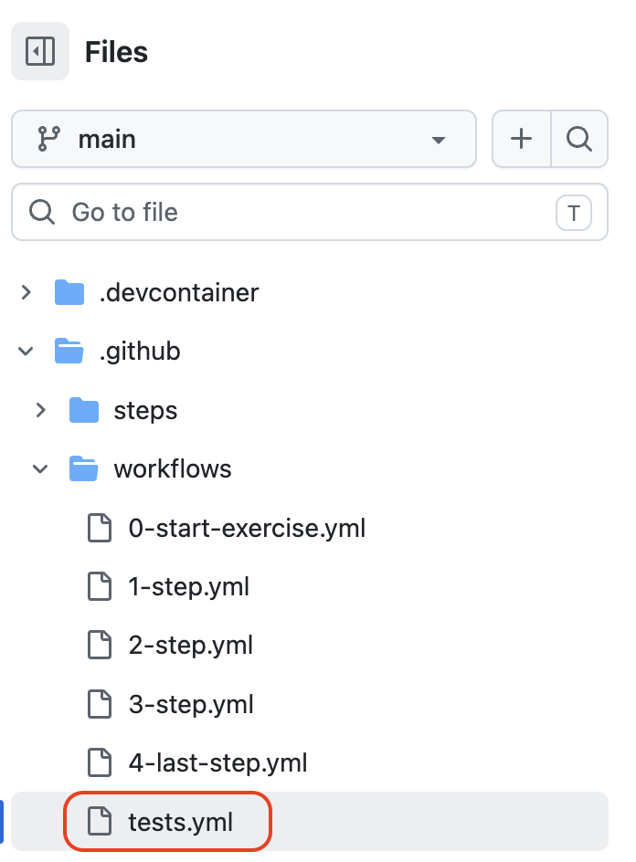
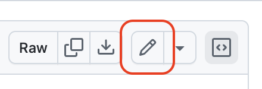
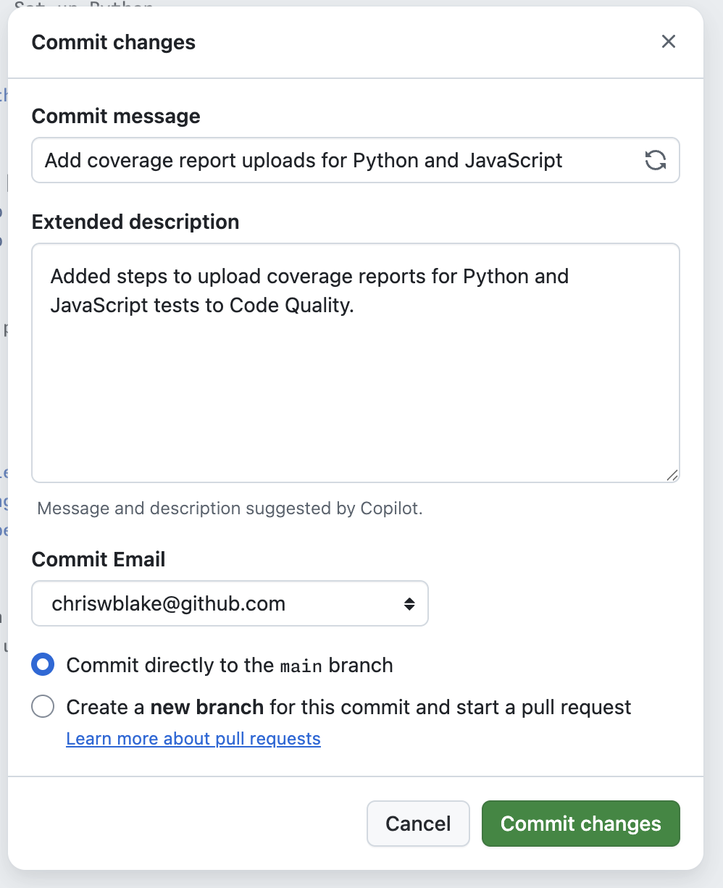

## Step 3: Monitoring Code Coverage

You show the principal the Code Quality findings, and she is relieved to finally see something concrete. But she asks a question you were not ready for: "How does this prevent teachers from breaking it in the future?"

You decided to enable coverage reporting so every pull request shows exactly how much of the changed code is ran by tests.

### 📖 Theory: Test Coverage As A Merge Signal

Test coverage complements static analysis by showing how much code is used during tests.

- The `actions/upload-code-coverage` action collects coverage reports in Cobertura format and sends them to Code Quality.
- Coverage results are then surfaced in pull request context by `github-code-quality[bot]`, appearing as a PR comment with a summary.
- Workflow permissions must allow writing code quality coverage data (`code-quality: write`).
- Committing this change to the default branch means every new pull request automatically gets a coverage summary — you will see this in the next step.
- These test coverage reports can be used directly in Rulesets (next step).

Read more:

- [Set Up Code Coverage](https://docs.github.com/en/code-security/how-tos/maintain-quality-code/set-up-code-coverage)
- [Upload Code Coverage](https://github.com/actions/upload-code-coverage)
- [Interpret Results](https://docs.github.com/en/code-security/how-tos/maintain-quality-code/interpret-results)

### ⌨️ Activity: Report Code Coverage

1. In your repository, open the **Code** tab and make sure you are on the `main` branch.

   

1. Open the testing workflow file at `.github/workflows/tests.yml`.

   

1. Select the **Edit this file** icon.

   

1. Update the existing `permissions:` block (line 27) to look like the block below. This adds `code-quality: write` permission which allows publishing coverage results.

   ```yaml
   permissions:
     contents: read
     code-quality: write
   ```

1. Locate the `test-py` job, and add the following step to the end, after the `Run unit tests with coverage output` step (line 50). Make sure to keep the same indentation.

   ```yaml
   - name: Upload Python coverage report to Code Quality
     uses: actions/upload-code-coverage@v1
     with:
       file: coverage/coverage-python.xml
       language: Python
       label: code-coverage/pytest
   ```

1. Do the same for the `test-js` job.

   ```yaml
   - name: Upload JavaScript coverage report to Code Quality
     uses: actions/upload-code-coverage@v1
     with:
       file: coverage/coverage-javascript.xml
       language: JavaScript
       label: code-coverage/jest
   ```

1. In the top right, click the **Commit Changes** button. Commit your changes directly to the `main` branch.

   

1. With the testing workflow updated, Mona will prepare the next step. Almost done!

<details>
<summary>Having trouble? 🤷</summary><br/>

- Confirm both jobs include the `actions/upload-code-coverage` action.
- Confirm the pull request targets the `main` branch.

</details>
