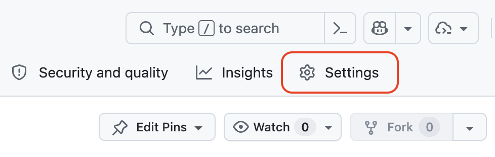
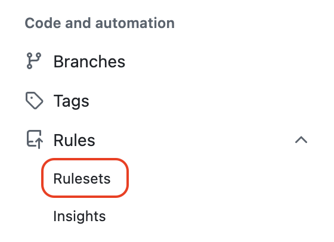
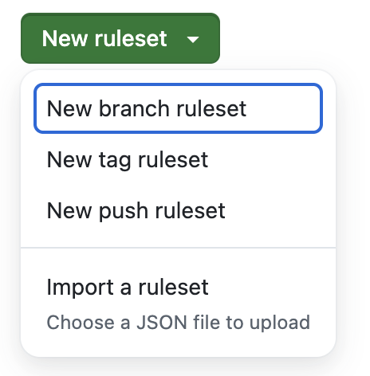
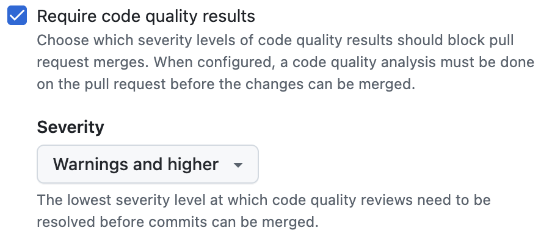
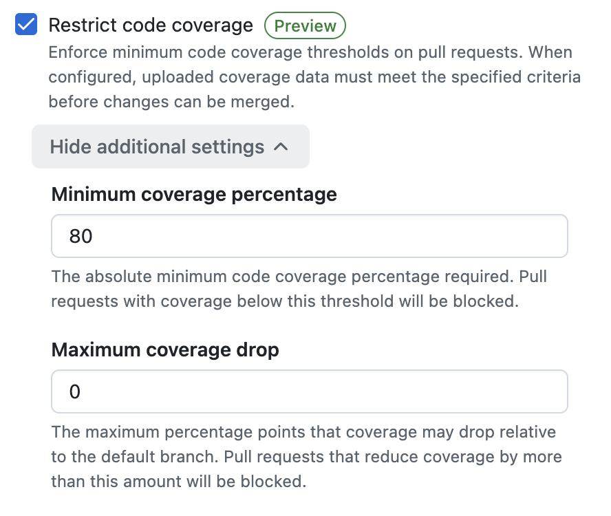
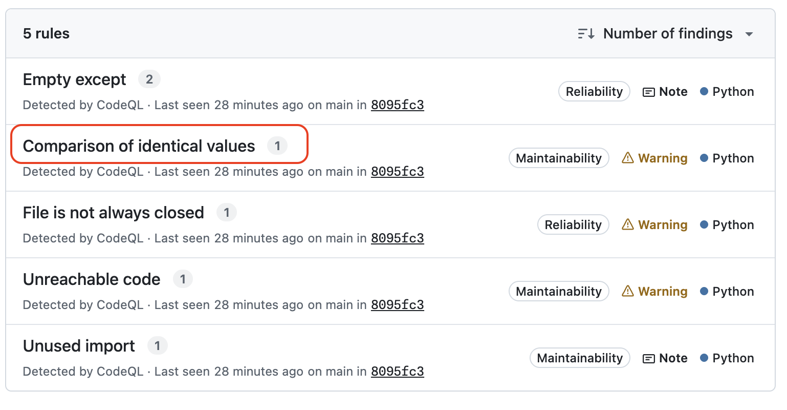
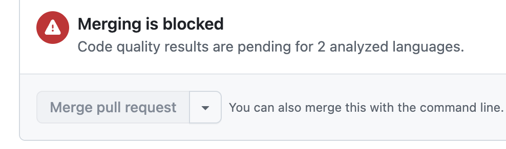
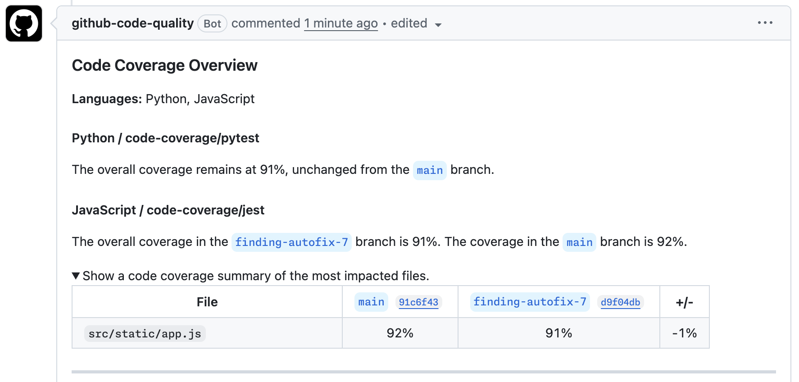

## Step 4: Enforce Quality And Coverage With Rulesets

The day after you share the findings report, a teacher merges a pull request before anyone reviews it. The deadline was tight, he says, and the checks all passed, but there were two quality findings on that pull request. The PR just wasn't blocking.

Visibility is not enough when the team is under pressure. You turn quality findings and coverage into an enforceable ruleset, then confirm that a fix satisfies the policy before it can merge.

### 📖 Theory: From Signals To Policy

Rulesets turn our quality checks and test coverage reports into enforceable merge standards.

- Quality severity thresholds can block pull requests when unresolved findings exceed limits.
- Test coverage restrictions can prevent merges when coverage drops too far, for example when tests get "accidentally" commented out.

Read More:

- [Set Pull Request Thresholds](https://docs.github.com/en/code-security/how-tos/maintain-quality-code/set-pr-thresholds)
- [Restrict Code Coverage](https://docs.github.com/en/code-security/how-tos/maintain-quality-code/restrict-code-coverage)
- [Unblock Your Pull Request](https://docs.github.com/en/code-security/how-tos/maintain-quality-code/unblock-your-pr)
- [About Rulesets](https://docs.github.com/en/repositories/configuring-branches-and-merges-in-your-repository/managing-rulesets/about-rulesets)

### ⌨️ Activity: Enable Quality Rulesets

1. In the top navigation, select the **Settings** tab.

   

1. In the left sidebar, expand **Rules** and select **Rulesets**.

   

1. Click the **New ruleset** button and select the **New branch ruleset** option.

   

1. Use the following details and selected options.
   - **Ruleset Name**: `Quality and Coverage`
   - **Enforcement status**: `Active`
   - **Target branches**: `Include default branch`

1. Under **Branch Rules**, enable the option `Require code quality results`. Set the severity threshold to `Warnings and higher`.

   

1. Under **Branch Rules**, enable the option `Restrict code coverage`. Set the **Minimum coverage percentage** to `80`.

   

1. Scroll to the bottom and select **Create** to save the ruleset.

Having trouble? 🤷
 

- Make sure the target includes the default branch (`main`).
- If checks are not evaluating later, confirm the enforcement status is correct.

### ⌨️ Activity: Fix one more finding

With the ruleset active, let's fix one more finding in the Mergington High codebase to confirm that the quality and coverage policy works end to end.

1. Return to the **Code quality** page that shows **Standard findings**.

1. Find and click on the item titled `Comparison of identical values` to show a details page.

   

1. Click the **Generate Fix** button, then **Open pull request** button.

1. With the pull request created, wait a moment for the workflows and quality scans to complete.

1. Notice the **Merge pull request** button is disabled since it is waiting for the test coverage results.

   

1. Notice the pull request comment providing details about the Python and JavaScript test coverage.

   

1. Click the **Ready for review** button to make it active.

1. Since all checks pass, click the **Merge pull request** button. After merging, you can delete this temporary branch.

1. With coverage enabled and enforced, you are all done! Wait a moment for Mona to share the final review! Nice work! 🎉

Having trouble? 🤷
 

- If the expected quality issue is not in the list, you can select another. Any of them will pass this step.

